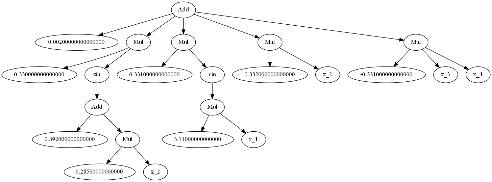

# Equation Learner

By [Subham S. Sahoo](https://arxiv.org/search/cs?searchtype=author&query=Sahoo%2C+S+S), [Christoph H. Lampert](https://cvml.ist.ac.at/) and [Georg Martius](http://georg.playfulmachines.com/)

Implemented by [Anselm Paulus](https://scholar.google.com/citations?user=njZL5CQAAAAJ&hl=en), Arnab Bhattacharjee, Andrii Zadaianchuk and [Michal Rolínek](https://scholar.google.de/citations?user=DVdSTFQAAAAJ&hl=en).


Autonomous Learning Group, [Max Planck Institute](https://is.tuebingen.mpg.de/) for Intelligent Systems.

## Table of Contents
0. [Introduction](#introduction)
0. [Usage](#usage)
0. [Dependencies](#dependencies)
0. [Notes](#notes)


## Introduction

This repository contains TensorFlow implementation of the architecture from the ICML 2018 paper ["Learning Equations for Extrapolation and Control"](https://arxiv.org/abs/1806.07259). This work proposes a neural network architecture for symbolic regression.

## Further developments (internal)

L0 regularization:

Go and install
python3 -m pip install --user git+https://gitlab.tuebingen.mpg.de/mrolinek/L0-regularization

python3 -m pip install --user numba sympy


## Usage

### Prepare data
Either provide a python function to 'learn' by calling
```
python3 data_utils.py "{'file_name': 'F1data', 'fn_to_learn': 'F1', 'train_val_examples': 10000, 'test_examples': 5000}"

```
or use your own numpy arrays saved in training/evaluation data files.

### Train individual model

Once the data is fixed train the model with
```
python3 train.py '{"train_val_file": "data/F1data_train_val", "test_file": "data/F1data_test"}'
```
Or possibly change some parameters with
```
python3 train.py '{"train_val_file": "data/F1data_train_val", "test_file": "data/F1data_test", "batch_size": 25}'
```

### Perform model selection

In case you want to follow the model selection procedure from the paper, first generate runfiles for all the required settings with
```
python3 createjobs.py '{"train_val_file": "data/F1data_train_val", "test_file": "data/F1data_test"}'
```

Then run all scripts in the jobs folder.

Finally the model selection is performed by

```
python3 model_selection.py "{'results_path': 'results/model_selection'}"
```

### Inspect the learned formulas

In each result folder one can find .png files with latex and graph representations of the learned formulas.

Latex representation of function F1:

Graph representation of function F1:


## Dependencies:
- python>=3.5
- tensorflow>=1.7
- graphviz (including binaries)
- latex

## Notes

*Disclaimer*: This code is a PROTOTYPE and may contains bugs. Use at your own risk.

*Contribute*: If you spot some incompatibility of have some additional ideas, contribute via a pull request! Thank you!
